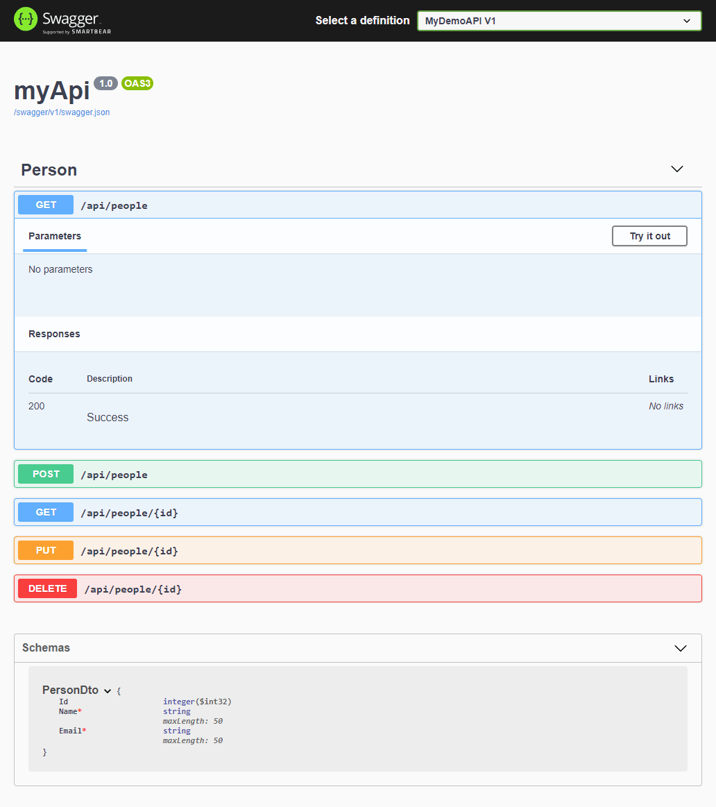
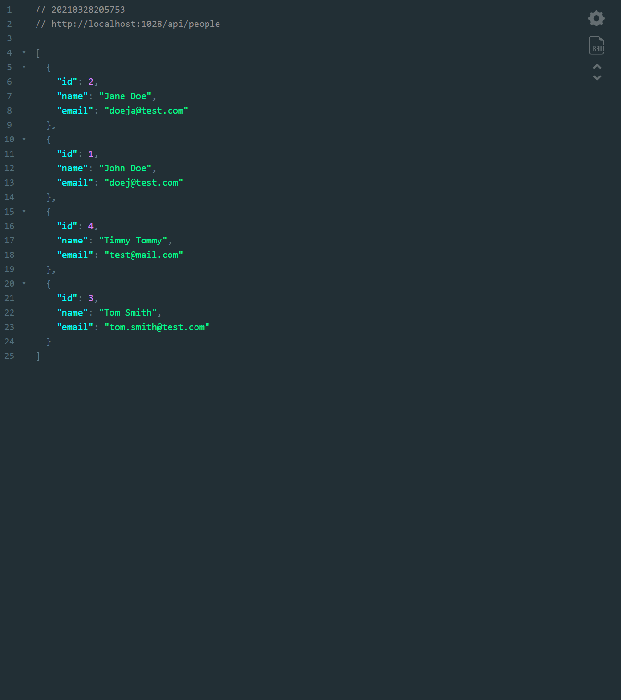

# MyDemo API Assessment 💾

Simple RESTful API built with ASP.NET Core 3.1 to show how to create RESTful services using a decoupled, maintainable architecture.

```http://localhost:1028/api/people``` [API Base Route](http://localhost:1028/api/people).

```http://localhost:1028/swagger/index.html``` [Swagger Docs](http://localhost:1028/swagger/index.html).

```http://localhost:1028/swagger/v1/swagger.json``` [Swagger Object Shape](http://localhost:1028/swagger/v1/swagger.json).

##### Try version `1.0.0-beta` using the following [link](#). Thanks!

## Frameworks and Libraries
- [ASP.NET Core 3.1](https://docs.microsoft.com/pt-br/aspnet/core/?view=aspnetcore-3.1)
- [AutoMapper](https://automapper.org/) (for mapping resources and models)
- [Swashbuckle](https://github.com/domaindrivendev/Swashbuckle) (API documentation)
- [NLog](https://nlog-project.org/) (assist with logging)

## How To Test

> First, install latest version of [.NET Core](https://dotnet.microsoft.com/download). Then, open the terminal at the API root path **/src/myDemo/** and run the following commands in sequence:

```bash
# Build Project
dotnet build
# Run Webserver
dotnet run
```

Navigate to ```http://localhost:1028/api/people``` to check if the API is working.

Navigate to ```http://localhost:1028/swagger``` to check the API documentation.

	
## Projects Description
This is a compilation list of various projects I have been working on since *[25 February 2021]*. These are the .Net applications and Pluralsight courses that I have completed or am working on currently. The other main resources I've been utilizing is the Microsoft [documentation](https://docs.microsoft.com/en-us/dotnet/), along with stackoverflow and various blog sites (medium, devio, c-sharpcorner and several others).

- [Various .Net Projects](https://github.com/cwooz/dotNet_Projects)
    - C# Fundamentals [link](https://app.pluralsight.com/library/courses/csharp-fundamentals-dev/table-of-contents)
    - C# Generics [link](https://app.pluralsight.com/library/courses/csharp-generics/table-of-contents)
    - LINQ Fundamentals [link](https://app.pluralsight.com/library/courses/linq-fundamentals-csharp-6/table-of-contents)
    - Entity Framework Core [link](https://app.pluralsight.com/library/courses/entity-framework-core-get-started/table-of-contents)
    - API ASP.NET Core [link](https://app.pluralsight.com/library/courses/building-api-aspdotnet-core/table-of-contents)
    - Building API with ASP.NET Core [link](https://app.pluralsight.com/library/courses/asp-dotnet-core-api-building-first/table-of-contents)
    - Best Practices: Entities, Validation, and View Models [link](https://app.pluralsight.com/library/courses/aspdotnet-core-bestpractices-models/)
- [BudgetCalculator](https://github.com/cwooz/BudgetCalculator)
    - Basic personal finance budget calculator.
- [CityInfoAPI](https://github.com/cwooz/CityInfo.API)
    - Basic API of cities with points of interest.
- [IdeasWebApp](https://github.com/cwooz/IdeasWebApp)
    - Fullstack .Net web application for recording ideas (Todo app).
- [CommanderAPI](https://github.com/cwooz/CommanderAPI)
    - API for recording and storing command line inputs.
- [CampsAPI](https://github.com/cwooz/CampsAPI)
    -  API for Code Camps Information.
- [Fox's Tale](https://github.com/cwooz/FoxTale)
    - Unity Engine 2D Platformer game using open-source assets from unity community, somewhere between Mario and Sonic.
- [NumberWizardConsole](https://github.com/cwooz/NumberWizardConsole)
    - Console Application Unity Engine Project: Calculates numbers from user input and display in the console.

<br/>
<br/>



